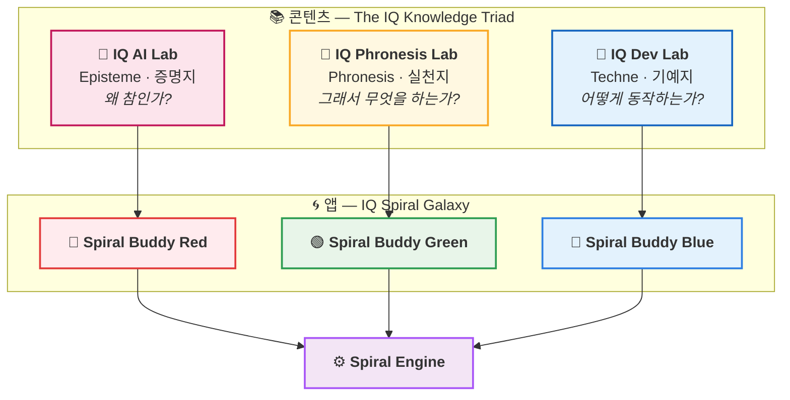
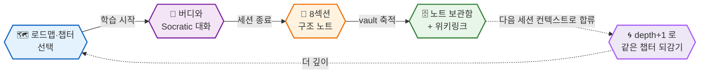

<h1 align="center">
  
  IQ Spiral Galaxy
</h1>

**AI 버디와 함께하는 나선형 학습 — 세 가지 색, 하나의 엔진**

 

 

> *"Don't just read it — spiral into it."*

딥다이브 레포를 **읽기만 하는 자료**에서  
**버디(AI)와 나선형으로 파고드는 학습 세션**으로 바꾸는 데스크톱 앱 패밀리입니다.

로드맵 따라 학습 → 버디와 Socratic 대화(`depth 1 → 2 → 3`) → **8섹션 구조 노트**로 자동 축적 →  
다음 세션에 이전 노트가 컨텍스트로 합류. **같은 개념을 나선형으로 되감을수록 깊어집니다.**

---

## 🌈 세 가지 버디 — Red · Green · Blue

각 버디는 하나의 **콘텐츠 연구소**를 학습 세션으로 바꾸는 데스크톱 앱입니다. 셋 다 같은 나선 엔진을 공유하지만, 다루는 영역과 그에 맞춘 특화 기능이 다릅니다.

| | 버디 | 무엇을 배우나 | 콘텐츠 소스 | 모토 | 규모 |
|:--:|:--|:--|:--|:--|:--|
| 🔴 | [**Spiral Buddy Red**](https://github.com/iq-spiral-galaxy/spiral-buddy-red) | **수학 · ML · DL · RL · LLM · CV** — 선형대수부터 Transformer·Diffusion까지 증명으로 따라가는 AI | [**IQ AI Lab**](https://github.com/iq-ai-lab) | *Prove, don't memorize* | `7 layers` · **48 repos** |
| 🟢 | [**Spiral Buddy Green**](https://github.com/iq-spiral-galaxy/spiral-buddy-green) | **실천적 지혜** — 돈·사람·제도·역사를 판단 규칙으로 증류 | [**IQ Phronesis Lab**](https://github.com/iq-phronesis-lab) | *Distill, don't collect* | `6 layers` · **31 repos** |
| 🔵 | [**Spiral Buddy Blue**](https://github.com/iq-spiral-galaxy/spiral-buddy-blue) | **Frontend · Backend · Android · iOS** — CS 기초·언어부터 인프라·DB까지 풀스택 딥다이브 | [**IQ Dev Lab**](https://github.com/iq-dev-lab) | *Beyond the docs* | `9 domains` · **86 repos** |

> 🎨 **RGB가 합쳐 백색광이 되듯**, 세 버디는 같은 나선 엔진을 공유하며 한 머신에 함께 깔 수 있습니다.

---

## 🗺️ Architecture — 콘텐츠는 셋, 엔진은 하나

연구소(콘텐츠)와 앱(엔진)을 분리한 구조입니다. 위층의 세 연구소가 *무엇을* 가르칠지를 정하고, 아래층의 단일 나선 엔진이 *어떻게* 가르칠지를 책임집니다.

> 세 연구소는 아리스토텔레스의 **앎의 세 형태**(Episteme · Techne · Phronesis)를 각각 맡습니다. Spiral Galaxy는 그 셋을 **같은 학습 경험**으로 손에 쥐여주는 전달 계층입니다.

---

## 🔁 나선형 학습이란? (Why "Spiral"?)

한 번 읽고 끝내는 직선이 아니라, **같은 챕터를 깊이를 더해 되감는 나선**입니다. 매 세션의 노트가 다음 세션의 출발점이 되어 컨텍스트가 복리로 쌓입니다.

| 깊이 | 의미 | 버디가 하는 일 |
|:--:|:--|:--|
| **d1** | 첫 학습 — 직관·정의·개념 세우기 | 큰 그림을 잡고, 핵심 개념을 내 언어로 정리 |
| **d2** | 복습 — 한 단계 더 | "헷갈렸던 지점"을 진입점으로, 증명/반례/경계 조건 사냥 |
| **d3+** | 심화 — 다른 것과 잇기 | 변형·엣지케이스·다른 레이어와의 횡단 연결로 종합 |

> 🔑 **이전 노트가 자동으로 새 세션 컨텍스트에 합류**합니다. 그래서 d2는 d1을 기억하고, d3는 d1·d2를 기억합니다 — 나선이 닫히지 않고 위로 감깁니다.

---

## ⚙️ 공통 엔진 — 세 버디가 공유하는 것

&nbsp;⚙️ &nbsp;<b>Spiral Engine</b> — 모든 버디에 들어있는 기능 &nbsp;<i>(펼치기)</i>

 

| 영역 | 기능 |
|:--|:--|
| 🗺️ **로드맵** | 로컬 디렉토리 + GitHub Curated 두 소스 공존 · README 링크 순서를 학습 순서로 사용 · 멀티 워크스페이스 |
| 🧭 **4단 계층 사이드바** | 도메인 → 카테고리 → 레포 → sub-roadmap → 챕터 · 마지막 학습 자동 활성화 · ⌘F 인라인 검색 · 레포별 진행도 바 + d1/d2/d3 배지 |
| 💬 **Socratic 세션** | depth 1→2→3 나선 반복 · 스트리밍 응답 · 모델 선택(Sonnet 4.6 기본 · Opus · Haiku) · 세션 Pause / Resume |
| 🔍 **Look-up 패널** | 대화를 끊지 않고 사이드에서 즉시 확인 · 드래그 + 깊이 선택(간결/중간/깊이/질문) · 중복 요청 차단(토큰 절약) · 👍/👎 피드백 |
| 📝 **8섹션 구조 노트** | 세션 종료 시 자동 정돈 · 위키링크(`[[note]]`) · Look-up 카드 callout 첨부 · **Obsidian 호환** |
| 🎯 **학습 도구** | 단계별 난이도 Quiz · ✨ 프롬프트 다듬기(`⌘J`) · ⌘K 통합 검색(노트 fulltext) |
| 📊 **학습 추적** | 1년치 활동 캘린더(5단계 강도) · Streak(연속 학습일) · 챕터별 진도 |
| 🛡️ **안정성** | `.trash/` 안전 삭제(30일 후 청소) · GitHub Releases 폴링 + 원클릭 자동 업데이트 · API `overloaded_error` backoff 자동 재시도 |
| 🧩 **MCP (옵션)** | 같은 vault를 공유하는 9개 도구로 Claude Desktop에서도 로드맵·노트·검색 사용 |
| 🖥️ **플랫폼** | macOS · Windows · Linux · 🌗 라이트/다크 모드 · ⚡ 30초 한 줄 설치 |

---

## 🎨 색깔별 특화 기능

같은 엔진 위에서, 각 버디는 다루는 영역에 맞춰 고유 기능을 더합니다.

&nbsp;🔴 &nbsp;<b>Red</b> — 수식이 깨지지 않는 학습 &nbsp;<i>(AI · 수학)</i>

 

- 🧮 **KaTeX 렌더링** — 채팅·Look-up·노트 미리보기에서 `$...$` / `$$...$$` LaTeX를 그대로 수식으로 렌더링 (한국어 조사 밀착, `aligned`·`pmatrix` 환경 포함)
- ⌨️ **수식 입력 도우미** — LaTeX를 몰라도 12개 카테고리·236개 기호 팔레트로 클릭 입력 · `$` 입력 시 라이브 미리보기 · `⌘\` 토글
- 📋 **수식 클릭 → LaTeX 복사** — 렌더링된 수식을 클릭하면 원본 LaTeX가 클립보드로 (Obsidian MathJax 호환 구분자)
- ✏️ **증명 중심 Socratic** — *"Prove, don't memorize"*: 정의 → 직관 → 정리 → 증명. 증명은 통째로 던지지 않고 다음 단계를 학습자가 먼저 시도
- 🔌 **렌더러 로컬 동봉** — KaTeX/marked를 앱에 내장, 네트워크와 무관하게 동작

&nbsp;🟢 &nbsp;<b>Green</b> — 판단 규칙으로 끝내는 학습 &nbsp;<i>(실천적 지혜)</i>

 

- 🧭 **판단 루프** — 버디가 **메커니즘 → 반례 → 판단 규칙** 순서로 파고드는 Socratic 대화 (*"결정을 바꾸지 못하는 지식은 잡학이다"*)
- 📐 **Principle → Boundary → Rule 노트** — *왜 작동하는가 → 언제 무너지는가 → 그래서 무엇을 하는가*로 끝나는 8섹션
- 💡 **챕터 미리보기 카드** — 챕터 옆 💡 클릭 → 핵심 질문 + **🧭 이 챕터로 내릴 수 있는 판단** 미리보기
- 🛡️ **세션 종료 가드** — 판단 규칙 없이 끝내려 하면 "압축 한 턴" 제안
- 📖 **판단 규칙 인덱스** — 모든 노트의 규칙만 모은 개인 의사결정 핸드북 (레이어별 그룹 + 검색)
- 🧬 **Synthesis 모드** — 본질 모델(인센티브·복리·피드백 루프·레버리지) 자동 태깅 → 횡단 챕터에서 다른 레이어의 과거 노트를 자동 소환

&nbsp;🔵 &nbsp;<b>Blue</b> — 풀스택 딥다이브 전 영역 &nbsp;<i>(개발)</i>

 

- 🗂️ **9개 도메인 / 86개 레포** — Foundations · Frontend · Backend · Android · iOS · Cross Platform · Data Engineering · Languages · Synthesis
- 🎚️ **역할 프리셋** — 백엔드(50) · 프론트엔드(20) · 모바일(25) · 풀스택+CS(86)을 한 번에 incremental clone (이미 받은 레포는 자동 skip)
- 📈 **워크스페이스 업그레이드** — 백엔드로 시작했다가 풀스택으로 넓혀도 기존 자료·진행도(d1/d2) 그대로 유지
- 🧱 **나선 엔진의 원본** — Red·Green이 상속한 인프라가 처음 만들어진 곳

---

## ⚡ 설치 — 30초, 한 줄

버디를 골라 해당 레포에서 **OS별 한 줄 명령**을 복사해 붙여넣으면 끝입니다 — 실행 중이면 자동 종료 → 최신 버전 다운로드 → 설치 → 재실행까지 한 번에. (GitHub Releases 고정 `latest` URL 사용 — rate-limit 없음)

| 버디 | 다운로드 | 플랫폼 |
|:--|:--|:--|
| 🔴 [**Red**](https://github.com/iq-spiral-galaxy/spiral-buddy-red#-30초-설치-한-줄-명령) | [latest release](https://github.com/iq-spiral-galaxy/spiral-buddy-red/releases/latest) | macOS(arm64/Intel) · Windows · Linux |
| 🟢 [**Green**](https://github.com/iq-spiral-galaxy/spiral-buddy-green#-30초-설치-한-줄-명령) | [latest release](https://github.com/iq-spiral-galaxy/spiral-buddy-green/releases/latest) | macOS(arm64/Intel) · Windows · Linux |
| 🔵 [**Blue**](https://github.com/iq-spiral-galaxy/spiral-buddy-blue#-30초-설치-한-줄-명령) | [latest release](https://github.com/iq-spiral-galaxy/spiral-buddy-blue/releases/latest) | macOS(arm64/Intel) · Windows · Linux |

첫 실행 시 **Setup Wizard**가 ① Anthropic API Key(`sk-ant-...`) ② 노트 보관함 폴더 ③ *(선택)* 프리셋으로 콘텐츠 한 번에 받기를 안내합니다. 노트·설정은 vault와 앱 지원 폴더에 저장되어 **재설치해도 보존**됩니다.

> 💡 세 버디는 노트 폴더·설정·포트가 분리되어 있어, 원하는 만큼 **동시에 설치해 함께 사용**할 수 있습니다.

---

## 🧰 기술 스택

`Electron` · `TypeScript` · `Hono` (로컬 API 서버) · vanilla JS SPA · `@anthropic-ai/sdk` · `@modelcontextprotocol/sdk` · `gray-matter` (frontmatter) · **Obsidian 호환** 마크다운 노트 출력

---

## 🔗 About — IQ Spiral Galaxy

세 버디가 길어 올리는 콘텐츠는 모두 **IQ Knowledge Triad** 연구소에서 옵니다.

 

[📐 **IQ AI Lab**](https://github.com/iq-ai-lab) — *Episteme* &nbsp;·&nbsp; [🔧 **IQ Dev Lab**](https://github.com/iq-dev-lab) — *Techne* &nbsp;·&nbsp; [🧭 **IQ Phronesis Lab**](https://github.com/iq-phronesis-lab) — *Phronesis*

 

**⭐️ 마음에 드셨다면 각 버디 레포에 Star를 눌러주세요!**

